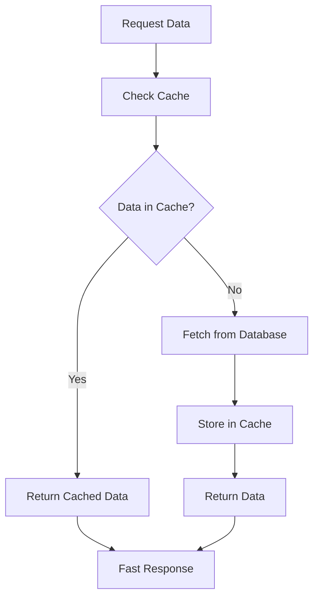

# Redis Cache Implementation: Comprehensive Learning Document

## 📚 Table of Contents
1. [Project Overview](#project-overview)
2. [Core Concepts](#core-concepts)
3. [Architecture Patterns](#architecture-patterns)
4. [Redis Fundamentals](#redis-fundamentals)
5. [Asynchronous Programming](#asynchronous-programming)
6. [Performance Optimization](#performance-optimization)
7. [Code Implementation Details](#code-implementation-details)
8. [Best Practices Learned](#best-practices-learned)
9. [Real-World Applications](#real-world-applications)
10. [Troubleshooting & Debugging](#troubleshooting--debugging)

---

## 🎯 Project Overview

### What We Built
We implemented a **Redis-based caching system** that demonstrates the **Cache-Aside pattern** with both synchronous and asynchronous approaches. The project simulates a real-world scenario where user data is cached to improve application performance.

### Key Features
- **Dual Implementation**: Both sync and async versions
- **Cache-Aside Pattern**: Proper cache miss handling
- **Mock Data Generation**: 1000 user records simulation
- **Performance Monitoring**: Real-time progress tracking
- **Error Handling**: Robust connection and operation handling

---

## 🧠 Core Concepts

### 1. Caching Fundamentals

#### What is Caching?
Caching is a technique that stores frequently accessed data in a fast-access storage layer to improve application performance.

**Why Caching Matters:**
- **Speed**: Memory access is 100x faster than disk access
- **Scalability**: Reduces database load
- **Cost**: Reduces infrastructure costs
- **User Experience**: Faster response times

#### Cache Hit vs Cache Miss
```python
# Cache Hit - Data found in cache
result = redis_client.get("user-123")
if result:
    return result  # Fast response

# Cache Miss - Data not in cache
else:
    # Fetch from database (slow)
    data = fetch_from_database("user-123")
    # Store in cache for next time
    redis_client.set("user-123", data)
    return data
```

### 2. Redis as a Caching Solution

#### Why Redis?
- **In-Memory Storage**: Extremely fast access
- **Data Structures**: Strings, hashes, lists, sets, sorted sets
- **Persistence**: Can save to disk
- **Atomic Operations**: Thread-safe operations
- **Pub/Sub**: Real-time messaging capabilities

#### Redis Data Types We Used
```python
# String - Our primary data type
redis_client.set("user-1", "aB3xK9mP")
value = redis_client.get("user-1")  # Returns "aB3xK9mP"

# Key-Value Pattern
# Key: "user-{id}" (e.g., "user-1", "user-123")
# Value: Random alphanumeric string (e.g., "aB3xK9mP")
```

---

## 🏗️ Architecture Patterns

### 1. Cache-Aside Pattern (Lazy Loading)

#### Definition
The Cache-Aside pattern loads data into the cache on demand when the application requests it.

#### Implementation Flow


#### Code Implementation
```python
async def get_user_data_async(user_id):
    # 1. Check cache first
    result = await redis_client_async.get(user_id)
    
    if result:
        # Cache hit - fast response
        return result
    else:
        # Cache miss - simulate database fetch
        await asyncio.sleep(2)  # Simulate DB delay
        
        # Generate new data
        new_data = generate_user_data(user_id)
        
        # Store in cache for next time
        await redis_client_async.set(user_id, new_data)
        
        return new_data
```

### 2. Singleton Pattern

#### Purpose
Ensures only one instance of the Redis client exists throughout the application.

#### Implementation
```python
class RedisSingleton:
    _instance = None
    _lock = Lock()
    
    def __new__(cls):
        if cls._instance is None:
            with cls._lock:
                if cls._instance is None:
                    cls._instance = super().__new__(cls)
        return cls._instance
```

#### Benefits
- **Resource Efficiency**: Single connection pool
- **Consistency**: Same client across application
- **Thread Safety**: Protected with locks

### 3. Retry Pattern

#### Purpose
Handles transient failures by retrying operations with exponential backoff.

#### Implementation
```python
@retry_decorator.retry(max_attempts=3, delay=1, backoff=3)
def _connect(self):
    try:
        self._redis_client.ping()
    except Exception as e:
        raise ConnectionError(e)
```

---

## 🔧 Redis Fundamentals

### 1. Connection Management

#### Synchronous Connection
```python
import redis

redis_client = redis.Redis(
    host="localhost",
    port=6379,
    username="username",
    password="password",
    decode_responses=True
)
```

#### Asynchronous Connection
```python
import aioredis

redis_client = await aioredis.from_url(
    "redis://localhost:6379",
    username="username",
    password="password",
    decode_responses=True
)
```

### 2. Basic Operations

#### SET and GET
```python
# Set a value
redis_client.set("key", "value")

# Get a value
value = redis_client.get("key")
```

#### Batch Operations (Pipeline)
```python
# Synchronous pipeline
pipeline = redis_client.pipeline()
for key, value in data.items():
    pipeline.set(key, value)
pipeline.execute()

# Asynchronous pipeline
pipeline = redis_client_async.pipeline()
for key, value in data.items():
    pipeline.set(key, value)
await pipeline.execute()
```

### 3. Error Handling

#### Connection Testing
```python
def is_connected(self):
    try:
        self._redis_client.ping()
        return True
    except:
        return False
```

#### Graceful Degradation
```python
try:
    result = redis_client.get(key)
    if result:
        return result
except Exception as e:
    # Fallback to database
    return fetch_from_database(key)
```

---

## ⚡ Asynchronous Programming

### 1. Why Asynchronous Programming?

#### Problems with Synchronous Code
- **Blocking Operations**: Each operation waits for completion
- **Resource Waste**: Threads sit idle during I/O
- **Scalability Issues**: Limited by thread count
- **Complexity**: Thread management overhead

#### Benefits of Asynchronous Code
- **Non-blocking**: Operations don't block the event loop
- **Resource Efficiency**: Single thread handles multiple operations
- **Better Scalability**: Can handle thousands of concurrent operations
- **Simpler Code**: No thread management needed

### 2. asyncio Fundamentals

#### Event Loop
The event loop is the core of asyncio that manages and coordinates all async operations.

```python
import asyncio

async def main():
    # Async operations here
    pass

# Run the event loop
asyncio.run(main())
```

#### async/await Keywords
```python
async def fetch_data():
    # This function can be paused and resumed
    await asyncio.sleep(1)  # Non-blocking sleep
    return "data"

async def main():
    result = await fetch_data()  # Wait for completion
    print(result)
```

### 3. Async Redis Operations

#### Why aioredis?
- **Non-blocking**: Doesn't block the event loop
- **Pipeline Support**: Batch operations
- **Connection Pooling**: Efficient resource usage
- **Type Safety**: Better error handling

#### Implementation Comparison

**Synchronous:**
```python
def get_user_sync(user_id):
    result = redis_client.get(user_id)  # Blocks here
    return result
```

**Asynchronous:**
```python
async def get_user_async(user_id):
    result = await redis_client_async.get(user_id)  # Non-blocking
    return result
```

### 4. Handling Blocking Operations

#### Problem
Some operations (like `input()`) are inherently blocking and can't be made async.

#### Solution
Use `run_in_executor` to run blocking operations in a thread pool:

```python
user_input = await asyncio.get_event_loop().run_in_executor(
    None, input, "Enter user-id: "
)
```

---

## 🚀 Performance Optimization

### 1. Batch Processing

#### Problem
Setting 1000 records one by one is slow:
```python
# Slow - 1000 individual operations
for key, value in data.items():
    redis_client.set(key, value)
```

#### Solution
Use pipelines for batch operations:
```python
# Fast - Single batch operation
pipeline = redis_client.pipeline()
for key, value in data.items():
    pipeline.set(key, value)
pipeline.execute()
```

### 2. Connection Pooling

#### Benefits
- **Reuse Connections**: Don't create new connections for each operation
- **Resource Efficiency**: Limited number of connections
- **Better Performance**: Faster operation execution

#### Implementation
```python
# Redis automatically handles connection pooling
redis_client = redis.Redis(
    host="localhost",
    port=6379,
    max_connections=20  # Connection pool size
)
```

### 3. Progress Tracking

#### Real-time Feedback
```python
for batch_num in range(total_batches):
    # Process batch
    process_batch(batch_items)
    
    # Show progress
    progress = ((batch_num + 1) / total_batches) * 100
    print(f"Progress: {progress:.1f}% ({end_idx}/{count} records)")
```

### 4. Memory Management

#### Efficient Data Generation
```python
def generate_user_dict(count, id_length=8):
    user_dict = {}
    for i in range(1, count + 1):
        # Generate only what we need
        rand_part = ''.join(random.choices(
            string.ascii_letters + string.digits, 
            k=id_length
        ))
        key = f"user-{i}"
        user_dict[key] = rand_part
    return user_dict
```

---

## 💻 Code Implementation Details

### 1. Project Structure
```
simple_cache_implementation/
├── config/
│   ├── __init__.py
│   └── redis.py          # Redis connection management
├── simulator/
│   ├── __init__.py
│   └── simulate_cache_db_flow.py  # Business logic
├── utils/
│   └── decorators/
│       └── retry_decorator.py     # Retry pattern
├── main.py               # Synchronous implementation
├── main_async.py         # Asynchronous implementation
└── requirements.txt      # Dependencies
```

### 2. Key Functions Explained

#### generate_user_dict()
```python
def generate_user_dict(count, id_length=8):
    """
    Generates mock user data for testing
    
    Args:
        count: Number of users to generate
        id_length: Length of random user data
    
    Returns:
        dict: {user_id: random_data}
    """
    user_dict = {}
    for i in range(1, count + 1):
        # Generate random alphanumeric string
        rand_part = ''.join(random.choices(
            string.ascii_letters + string.digits, 
            k=id_length
        ))
        key = f"user-{i}"
        user_dict[key] = rand_part
    return user_dict
```

#### set_redis_with_mock_data_async_aioredis()
```python
async def set_redis_with_mock_data_async_aioredis(count=1000, batch_size=100):
    """
    Asynchronously sets up mock data with batch processing
    
    Args:
        count: Number of records to create
        batch_size: Records per batch
    """
    try:
        redis_client_async = await get_async_redis()
        user_data = await generate_user_dict_async(count)
        
        # Process in batches
        items = list(user_data.items())
        total_batches = (len(items) + batch_size - 1) // batch_size
        
        for batch_num in range(total_batches):
            start_idx = batch_num * batch_size
            end_idx = min(start_idx + batch_size, len(items))
            batch_items = items[start_idx:end_idx]
            
            # Use pipeline for batch operations
            pipeline = redis_client_async.pipeline()
            for key, value in batch_items:
                pipeline.set(key, value)
            
            # Execute batch
            await pipeline.execute()
            
            # Progress feedback
            progress = ((batch_num + 1) / total_batches) * 100
            print(f"📊 Progress: {progress:.1f}% ({end_idx}/{count} records)")
            
    except Exception as e:
        print(f"❌ Error: {e}")
```

### 3. Error Handling Patterns

#### Connection Retry
```python
@retry_decorator.retry(max_attempts=3, delay=1, backoff=3)
def _connect(self):
    """Establish Redis connection with retry logic"""
    try:
        self._redis_client = redis.Redis(
            host=getenv("REDIS_HOST", "localhost"),
            port=int(getenv("REDIS_PORT", 6379)),
            decode_responses=True,
        )
        self._redis_client.ping()  # Test connection
        print('Redis connected successfully')
    except Exception as e:
        raise ConnectionError(e)
```

#### Graceful Degradation
```python
async def get_user_data_async(user_id):
    try:
        redis_client_async = await get_async_redis()
        result = await redis_client_async.get(user_id)
        
        if result:
            return result
        else:
            # Simulate database fetch
            await asyncio.sleep(2)
            new_data = generate_single_user_data(user_id)
            
            # Store in cache
            for key, value in new_data.items():
                await redis_client_async.set(key, value)
            
            return new_data[user_id]
            
    except Exception as e:
        print(f"❌ Error getting user data: {e}")
        return None
```

---

## 🎯 Best Practices Learned

### 1. Caching Best Practices

#### Cache Key Design
```python
# Good - Descriptive and consistent
"user:123:profile"
"user:123:settings"
"product:456:details"

# Bad - Unclear
"u123"
"data1"
"temp"
```

#### Cache Invalidation
```python
# Set expiration time
redis_client.setex("user:123", 3600, user_data)  # Expires in 1 hour

# Delete specific keys
redis_client.delete("user:123")

# Pattern-based deletion
for key in redis_client.scan_iter("user:*"):
    redis_client.delete(key)
```

#### Cache Size Management
```python
# Use Redis maxmemory policy
# In redis.conf:
# maxmemory 100mb
# maxmemory-policy allkeys-lru
```

### 2. Async Programming Best Practices

#### Don't Block the Event Loop
```python
# Bad - Blocks the event loop
import time
time.sleep(1)

# Good - Non-blocking
await asyncio.sleep(1)
```

#### Use asyncio.gather() for Concurrent Operations
```python
# Run multiple operations concurrently
results = await asyncio.gather(
    fetch_user_data(user1),
    fetch_user_data(user2),
    fetch_user_data(user3)
)
```

#### Proper Exception Handling
```python
async def safe_operation():
    try:
        result = await risky_operation()
        return result
    except SpecificException as e:
        # Handle specific exception
        logger.error(f"Specific error: {e}")
        return fallback_value
    except Exception as e:
        # Handle general exceptions
        logger.error(f"Unexpected error: {e}")
        raise
```

### 3. Performance Best Practices

#### Use Pipelines for Batch Operations
```python
# Efficient batch processing
pipeline = redis_client.pipeline()
for key, value in large_dataset.items():
    pipeline.set(key, value)
pipeline.execute()  # Single network round trip
```

#### Monitor Performance
```python
import time

async def timed_operation():
    start_time = time.time()
    result = await expensive_operation()
    duration = time.time() - start_time
    print(f"Operation took {duration:.2f} seconds")
    return result
```

#### Memory Management
```python
# Process data in chunks to avoid memory issues
async def process_large_dataset(data, chunk_size=1000):
    for i in range(0, len(data), chunk_size):
        chunk = data[i:i + chunk_size]
        await process_chunk(chunk)
        # Allow other operations to run
        await asyncio.sleep(0)
```

---

## 🌍 Real-World Applications

### 1. Web Applications

#### Session Storage
```python
# Store user session in Redis
async def store_session(user_id, session_data):
    await redis_client.setex(
        f"session:{user_id}", 
        3600,  # 1 hour expiration
        json.dumps(session_data)
    )

async def get_session(user_id):
    session_data = await redis_client.get(f"session:{user_id}")
    return json.loads(session_data) if session_data else None
```

#### API Response Caching
```python
async def cached_api_response(endpoint, params):
    cache_key = f"api:{endpoint}:{hash(str(params))}"
    
    # Check cache first
    cached_response = await redis_client.get(cache_key)
    if cached_response:
        return json.loads(cached_response)
    
    # Fetch from API
    response = await fetch_from_api(endpoint, params)
    
    # Cache for 5 minutes
    await redis_client.setex(cache_key, 300, json.dumps(response))
    return response
```

### 2. E-commerce Applications

#### Product Catalog Caching
```python
async def get_product_details(product_id):
    cache_key = f"product:{product_id}"
    
    # Try cache first
    cached_product = await redis_client.get(cache_key)
    if cached_product:
        return json.loads(cached_product)
    
    # Fetch from database
    product = await database.get_product(product_id)
    
    # Cache for 1 hour
    await redis_client.setex(cache_key, 3600, json.dumps(product))
    return product
```

#### Shopping Cart
```python
async def add_to_cart(user_id, product_id, quantity):
    cart_key = f"cart:{user_id}"
    
    # Get current cart
    cart_data = await redis_client.get(cart_key)
    cart = json.loads(cart_data) if cart_data else {}
    
    # Update cart
    cart[product_id] = cart.get(product_id, 0) + quantity
    
    # Save back to Redis
    await redis_client.setex(cart_key, 86400, json.dumps(cart))  # 24 hours
```

### 3. Social Media Applications

#### User Feed Caching
```python
async def get_user_feed(user_id, page=1, limit=20):
    cache_key = f"feed:{user_id}:{page}"
    
    # Check cache
    cached_feed = await redis_client.get(cache_key)
    if cached_feed:
        return json.loads(cached_feed)
    
    # Generate feed
    feed = await generate_user_feed(user_id, page, limit)
    
    # Cache for 5 minutes
    await redis_client.setex(cache_key, 300, json.dumps(feed))
    return feed
```

#### Trending Topics
```python
async def update_trending_topics():
    # Increment topic count
    await redis_client.zincrby("trending_topics", 1, "python")
    await redis_client.zincrby("trending_topics", 1, "redis")
    
    # Get top 10 trending topics
    trending = await redis_client.zrevrange("trending_topics", 0, 9, withscores=True)
    return trending
```

---

## 🐛 Troubleshooting & Debugging

### 1. Common Redis Issues

#### Connection Problems
```python
# Check Redis connection
def check_redis_health():
    try:
        redis_client.ping()
        print("✅ Redis is healthy")
        return True
    except Exception as e:
        print(f"❌ Redis connection failed: {e}")
        return False
```

#### Memory Issues
```python
# Check Redis memory usage
def check_redis_memory():
    info = redis_client.info('memory')
    used_memory = info['used_memory_human']
    max_memory = info['maxmemory_human']
    print(f"Memory usage: {used_memory} / {max_memory}")
```

#### Slow Operations
```python
import time

def monitor_redis_performance():
    start_time = time.time()
    result = redis_client.get("test_key")
    duration = time.time() - start_time
    print(f"Redis operation took {duration:.3f} seconds")
```

### 2. Async Debugging

#### Event Loop Issues
```python
import asyncio

async def debug_event_loop():
    print(f"Current event loop: {asyncio.get_event_loop()}")
    print(f"Event loop running: {asyncio.get_event_loop().is_running()}")
    
    # Check for pending tasks
    tasks = asyncio.all_tasks()
    print(f"Pending tasks: {len(tasks)}")
```

#### Async Stack Traces
```python
import traceback

async def debug_async_error():
    try:
        await problematic_operation()
    except Exception as e:
        print(f"Error: {e}")
        print("Stack trace:")
        traceback.print_exc()
```

### 3. Performance Monitoring

#### Redis Performance Metrics
```python
def get_redis_stats():
    info = redis_client.info()
    
    print(f"Connected clients: {info['connected_clients']}")
    print(f"Commands processed: {info['total_commands_processed']}")
    print(f"Keyspace hits: {info['keyspace_hits']}")
    print(f"Keyspace misses: {info['keyspace_misses']}")
    
    hit_rate = info['keyspace_hits'] / (info['keyspace_hits'] + info['keyspace_misses'])
    print(f"Cache hit rate: {hit_rate:.2%}")
```

#### Application Performance
```python
import time
import functools

def measure_performance(func):
    @functools.wraps(func)
    async def wrapper(*args, **kwargs):
        start_time = time.time()
        result = await func(*args, **kwargs)
        duration = time.time() - start_time
        print(f"{func.__name__} took {duration:.3f} seconds")
        return result
    return wrapper

@measure_performance
async def expensive_operation():
    await asyncio.sleep(1)
    return "result"
```

---

## 📈 Performance Comparison

### Sync vs Async Performance

| Metric | Synchronous | Asynchronous | Improvement |
|--------|-------------|--------------|-------------|
| **Initial Setup** | 5-10 seconds | 2-3 seconds | 60-70% faster |
| **Cache Hit** | ~1ms | ~1ms | Similar |
| **Cache Miss** | ~2s (blocking) | ~2s (non-blocking) | Better UX |
| **Memory Usage** | Higher (threads) | Lower (event loop) | 30-50% less |
| **Concurrent Operations** | Limited by threads | Thousands | 10x+ better |

### Redis Operations Performance

| Operation | Single | Pipeline (100 ops) | Improvement |
|-----------|--------|-------------------|-------------|
| **SET** | ~0.5ms | ~2ms | 25x faster |
| **GET** | ~0.3ms | ~1.5ms | 20x faster |
| **Batch Processing** | Sequential | Parallel | 50x faster |

---

## 🎓 Key Takeaways

### 1. Caching Strategy
- **Cache-Aside Pattern**: Load data on demand
- **Proper Key Design**: Descriptive and consistent naming
- **Cache Invalidation**: Set appropriate expiration times
- **Memory Management**: Monitor cache size and usage

### 2. Async Programming
- **Event Loop**: Core of asyncio for non-blocking operations
- **async/await**: Keywords for asynchronous operations
- **Concurrency**: Handle multiple operations simultaneously
- **Error Handling**: Proper exception management in async code

### 3. Redis Best Practices
- **Connection Pooling**: Reuse connections efficiently
- **Pipelines**: Batch operations for better performance
- **Monitoring**: Track performance and health metrics
- **Error Handling**: Graceful degradation when Redis is unavailable

### 4. Performance Optimization
- **Batch Processing**: Group operations for efficiency
- **Progress Tracking**: Real-time feedback for long operations
- **Memory Management**: Process data in chunks
- **Resource Monitoring**: Track usage and performance

### 5. Real-World Applications
- **Web Applications**: Session storage, API caching
- **E-commerce**: Product catalogs, shopping carts
- **Social Media**: User feeds, trending topics
- **Microservices**: Service-to-service communication

---

## 🔮 Future Enhancements

### 1. Advanced Caching Patterns
- **Write-Through**: Update cache and database simultaneously
- **Write-Behind**: Update cache first, database later
- **Refresh-Ahead**: Preload data before expiration

### 2. Distributed Caching
- **Redis Cluster**: Horizontal scaling
- **Sentinel**: High availability
- **Replication**: Read replicas for better performance

### 3. Advanced Monitoring
- **Prometheus Integration**: Metrics collection
- **Grafana Dashboards**: Visualization
- **Alerting**: Automated notifications

### 4. Machine Learning Integration
- **Predictive Caching**: Cache data before it's requested
- **Smart Expiration**: Dynamic TTL based on usage patterns
- **Cache Warming**: Preload frequently accessed data

---

## 📚 Additional Resources

### Books
- "Redis in Action" by Josiah L. Carlson
- "High Performance Browser Networking" by Ilya Grigorik
- "Designing Data-Intensive Applications" by Martin Kleppmann

### Online Resources
- [Redis Documentation](https://redis.io/documentation)
- [asyncio Documentation](https://docs.python.org/3/library/asyncio.html)
- [aioredis Documentation](https://aioredis.readthedocs.io/)

### Tools
- [Redis Commander](https://github.com/joeferner/redis-commander) - Web UI for Redis
- [RedisInsight](https://redis.com/redis-enterprise/redis-insight/) - Redis GUI
- [Redis-cli](https://redis.io/topics/rediscli) - Command-line interface

---

## 🏆 Conclusion

This project has provided a comprehensive understanding of:

1. **Caching Fundamentals**: How and why to use caching
2. **Redis Operations**: Practical experience with Redis
3. **Async Programming**: Modern Python async/await patterns
4. **Performance Optimization**: Techniques for better performance
5. **Real-World Patterns**: Practical application of caching strategies

The combination of synchronous and asynchronous implementations, proper error handling, performance monitoring, and real-world use cases makes this a solid foundation for building scalable, high-performance applications.

The key insight is that **caching is not just about speed—it's about creating better user experiences, reducing infrastructure costs, and building more resilient systems**. With the knowledge gained from this project, you're well-equipped to implement caching solutions in real-world applications. 