# Redis Cache Implementation Flow Diagram

## 🚀 Application Startup Flow

```mermaid
graph TD
    A[Application Start] --> B[Load Environment Variables]
    B --> C[Initialize Redis Singleton]
    C --> D{Redis Connection Type}
    
    D -->|Sync| E[Create redis.Redis Client]
    D -->|Async| F[Create aioredis Client]
    
    E --> G[Test Connection with ping()]
    F --> H[Test Connection with await ping()]
    
    G --> I{Connection Success?}
    H --> I
    
    I -->|Yes| J[✅ Redis Connected]
    I -->|No| K[❌ Connection Failed]
    
    J --> L[Setup Mock Data]
    K --> M[Exit Application]
```

## 📊 Mock Data Setup Flow

```mermaid
graph TD
    A[Setup Mock Data] --> B{Setup Method}
    
    B -->|Sync| C[set_redis_with_mock_data]
    B -->|Threaded| D[set_redis_with_mock_data_async]
    B -->|Async| E[set_redis_with_mock_data_async_aioredis]
    
    C --> F[Generate 1000 User Records]
    D --> F
    E --> F
    
    F --> G[Process in Batches]
    G --> H[Set Key-Value Pairs in Redis]
    
    H --> I{Progress Feedback}
    I -->|Sync| J[Blocking Progress]
    I -->|Threaded| K[Background Progress]
    I -->|Async| L[Async Progress with Pipeline]
    
    J --> M[✅ Setup Complete]
    K --> M
    L --> M
```



## 🎮 User Interaction Flow

```mermaid
graph TD
    A[User Input] --> B[Enter User ID]
    B --> C{Input Validation}
    
    C -->|Valid| D[Query Redis Cache]
    C -->|'q'| E[Exit Application]
    C -->|Invalid| F[Error Message]
    
    D --> G{Cache Hit?}
    
    G -->|Yes| H[Return Cached Data]
    G -->|No| I[Cache Miss - Simulate DB Fetch]
    
    H --> J[Display: "Found in cache: user-X = value"]
    I --> K[Wait 2 seconds]
    K --> L[Generate New User Data]
    L --> M[Store in Redis Cache]
    M --> N[Display: "Stored: user-X = value"]
    
    J --> O[Continue Loop]
    N --> O
    F --> O
    O --> A
```

## 🔄 Cache-Aside Pattern Flow


## ⚡ Async vs Sync Performance Comparison


## 🏗️ Architecture Overview


## 📈 Data Flow Sequence


## 🔧 Key Components

### **Sync Implementation:**
- `main.py` - Synchronous main application
- `redis.Redis` - Blocking Redis client
- Threading for background tasks
- Sequential data processing

### **Async Implementation:**
- `main_async.py` - Asynchronous main application
- `aioredis` - Non-blocking Redis client
- `asyncio` for concurrency
- Pipeline operations for batch processing

### **Shared Components:**
- `config/redis.py` - Redis connection management
- `simulator/simulate_cache_db_flow.py` - Business logic
- Environment-based configuration
- Singleton pattern for Redis client

## 🎯 Performance Characteristics

| Operation | Sync Version | Async Version |
|-----------|-------------|---------------|
| **Initial Setup** | Blocking (5-10s) | Non-blocking (2-3s) |
| **Cache Hit** | ~1ms | ~1ms |
| **Cache Miss** | ~2s (blocking) | ~2s (non-blocking) |
| **Batch Operations** | Sequential | Pipeline |
| **User Input** | Blocking | Non-blocking |
| **Memory Usage** | Higher (threads) | Lower (event loop) |